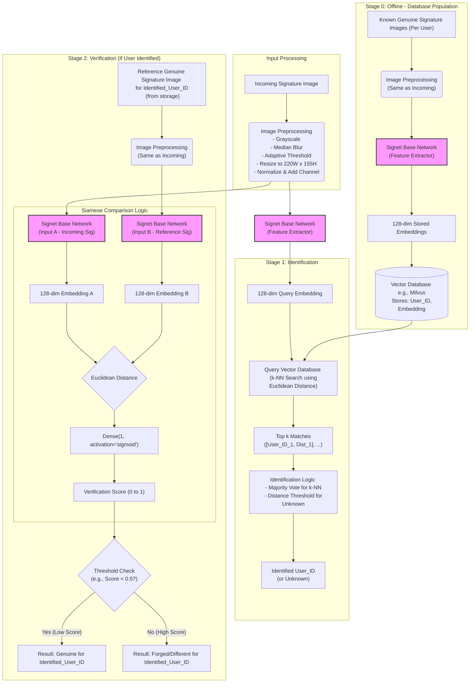

```mermaid
graph TD;
    subgraph "Input Processing";
        A_Incoming["Incoming Signature Image"] --> B_PreprocIncoming("Image Preprocessing <br> - Grayscale <br> - Median Blur <br> - Adaptive Threshold <br> - Resize to 220W x 155H <br> - Normalize & Add Channel");
    end;

    B_PreprocIncoming --> C_BaseNetIncoming["Signet Base Network <br> (Feature Extractor)"];
    C_BaseNetIncoming --> D_QueryEmbedding["128-dim Query Embedding"];

    subgraph "Stage 0: Offline - Database Population";
        AA_KnownGenuine["Known Genuine Signature Images (Per User)"] --> BB_PreprocKnown("Image Preprocessing <br> (Same as Incoming)");
        BB_PreprocKnown --> CC_BaseNetKnown["Signet Base Network <br> (Feature Extractor)"];
        CC_BaseNetKnown --> DD_StoredEmbeddings["128-dim Stored Embeddings"];
        DD_StoredEmbeddings --> EE_VectorDB[("Vector Database <br> e.g., Milvus <br> Stores: User_ID, Embedding")];
    end;

    subgraph "Stage 1: Identification";
        D_QueryEmbedding --> F_QueryDB["Query Vector Database <br> (k-NN Search using Euclidean Distance)"];
        EE_VectorDB --> F_QueryDB;
        F_QueryDB --> G_TopMatches["Top k Matches <br> ([User_ID_1, Dist_1], ...)"];
        G_TopMatches --> H_IdentLogic["Identification Logic <br> - Majority Vote for k-NN <br> - Distance Threshold for Unknown"];
        H_IdentLogic --> I_IdentifiedUserID["Identified User_ID <br> (or Unknown)"];
    end;

    subgraph "Stage 2: Verification (if User Identified)";
        J_RefImage["Reference Genuine Signature Image <br> for Identified_User_ID <br> (from storage)"] --> K_PreprocRef("Image Preprocessing <br> (Same as Incoming)");
        B_PreprocIncoming --> L1_BaseNetSiameseA["Signet Base Network <br> (Input A - Incoming Sig)"];
        K_PreprocRef --> L2_BaseNetSiameseB["Signet Base Network <br> (Input B - Reference Sig)"];

        subgraph "Siamese Comparison Logic";
            direction LR;
            L1_BaseNetSiameseA --> M1_EmbeddingA["128-dim Embedding A"];
            L2_BaseNetSiameseB --> M2_EmbeddingB["128-dim Embedding B"];
            M1_EmbeddingA --> N_EuclideanDist{"Euclidean Distance"};
            M2_EmbeddingB --> N_EuclideanDist;
            N_EuclideanDist --> O_SigmoidLayer["Dense(1, activation='sigmoid')"];
            O_SigmoidLayer --> P_VerificationScore["Verification Score (0 to 1)"];
        end;
        P_VerificationScore --> Q_ThresholdCheck{"Threshold Check <br> (e.g., Score < 0.5?)"};
        Q_ThresholdCheck -- Yes (Low Score) --> R_Genuine["Result: Genuine for Identified_User_ID"];
        Q_ThresholdCheck -- No (High Score) --> S_Forged["Result: Forged/Different for Identified_User_ID"];
    end;

    %% Style and Note Directives - Reordered: Styles first, then Notes
    style C_BaseNetIncoming fill:#f9f,stroke:#333,stroke-width:2px;
    style CC_BaseNetKnown fill:#f9f,stroke:#333,stroke-width:2px;
    style L1_BaseNetSiameseA fill:#f9f,stroke:#333,stroke-width:2px;
    style L2_BaseNetSiameseB fill:#f9f,stroke:#333,stroke-width:2px;

    %% note right of C_BaseNetIncoming "Shared Weights";
    %% note right of CC_BaseNetKnown "Shared Weights";
    %% note right of L1_BaseNetSiameseA "Shared Weights";
    %% note right of L2_BaseNetSiameseB "Shared Weights";
```
